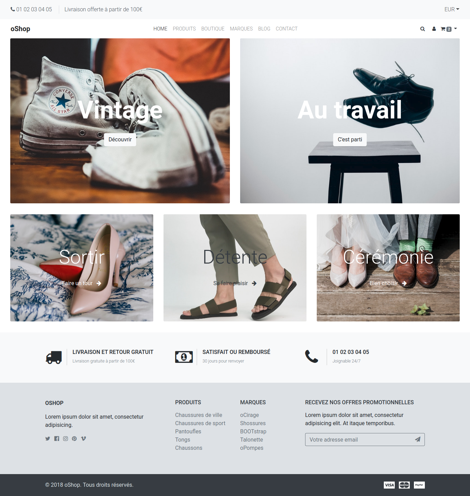
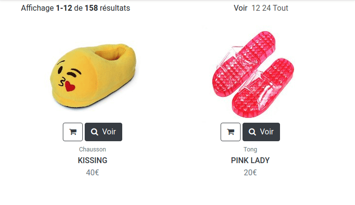
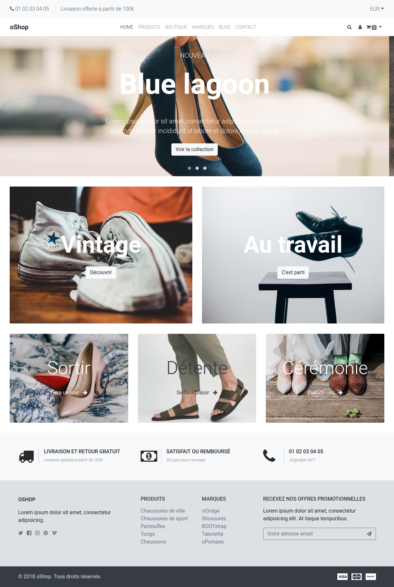

# oShop - Dans les shoe

En voila une boutique séduisante :yum:

Oui mais... c'est à vous de l'intégrer :scream:

Pas de panique, un outil est là pour vous y aider. Bootstrap :sunglasses:

Dans le dossier `resultat/` quelques captures sont présentes

## Travail d'équipe

- Maintenant qu'on a vu les git _Pull Requests_, vous pouvez travailler à plusieurs et en parallèle sur le même dépôt
- donc, vous avez le choix entre _PairProgramming_ et programmer chacun de son côté
- nous vous conseillons fortement de faire au moins **les 2 premières étapes en PairProgramming**

## Instructions

### Préambule

- dans le répertoire `html`, vous avez le code source HTML utilisant le framework Bootstrap
  - mise en page simplifiée
  - utilisation de components existants
- cependant, l'intégration HTML/CSS demandée ne correspond pas totalement au visu des sources fournies
  - au cours des étapes qui vont suivre, vous allez devoir "surcharger" Bootstrap dans le fichier `css/styles.css`
  - le code HTML est censé être suffisant en l'état, mais vous pouvez bien entendu le modifier
- chaque étape présente un mélange entre
  - utilisation de l'architecture, l'organisation des fichiers vue en cours
  - intégration HTML/CSS

### Etape 1 - Layout

- analyser les zones qui se répètent d'une page à l'autre
- commencer par l'intégration HTML/CSS de ces "zones" / ce "gabarit" / ce "layout"
- on laisse le contenu spécifique à chaque page pour plus tard

### Etape 2 - Templates / Views

- une fois le "layout" mis en place, on va le mettre en place dans notre projet _oShop_
- les fichiers CSS, images et JavaScript sont à placer dans le répertoire `public/assets/` (puis un des sous-répertoires)
  - il faudra certainement ensuite modifier les liens (**URLs**) vers ces fichiers
- ensuite, pour le layout, vous aurez besoin de créer les _views_ "header" et "footer" :wink:

Spoiler

On pourra (ré)utiliser la méthode `show()` vue en cours

### Etape 3 - Home

- faire l'intégration HTML/CSS de la page d'accueil directement dans le projet

### Etape 4 - Catégorie

- faire l'intégration HTML/CSS de la page catégorie (liste de produits) directement dans le projet

### Bonus

- faire l'intégration HTML/CSS des autres pages, directement dans le projet (bonus Fioritures)
- ou alors réflechir à la structure de la base de données (bonus Base De Données)
- l'un ou l'autre, ou les 2 :wink: :muscle:

### Bonus Fioritures :lipstick:

#### ... fun

et si on animait un peu cette interface. Dans la partie catégorie on pourrait légèrement modifier la présentation de nos produits 

#### ... qui pique

Si nous ajoutions un sélecteur de devise et un résumé du panier sur TOUTES les pages de la boutique ?

#### ... de la mort

Pourquoi ne pas ajouter un carousel à cette page d'accueil ?

Cet [outil](https://owlcarousel2.github.io/OwlCarousel2/) semble très adapté :+1:

### Bonus Base De Données :floppy_disk:

#### Modèle Conceptuel de Données :books:

- maintenant que vous avez les créas, vous pouvez réfléchir aux données nécessaires au bon fonctionnement de la boutique
- après avoir recensé les données de chaque page, vous pouvez déterminer comment elles se regroupent en différentes entités et représenter le tout sous la forme d'un MCD
- ces réflexions permettront de préparer sereinement la prochaine journée de cours
- pour vous aider dans cette phase de conception, n'hésitez pas à utiliser Mocodo :crown:
- vous pouvez aussi prendre comme exemple le travail effectué sur les projets de la saison 4

#### Dictionnaire des données :memo:

- une fois le MCD créé, vous allez rédiger le dico des données correspondant dans un fichier Markdown
- vous pouvez prendre comme exemple le travail effectué sur le MCD de la saison 4
